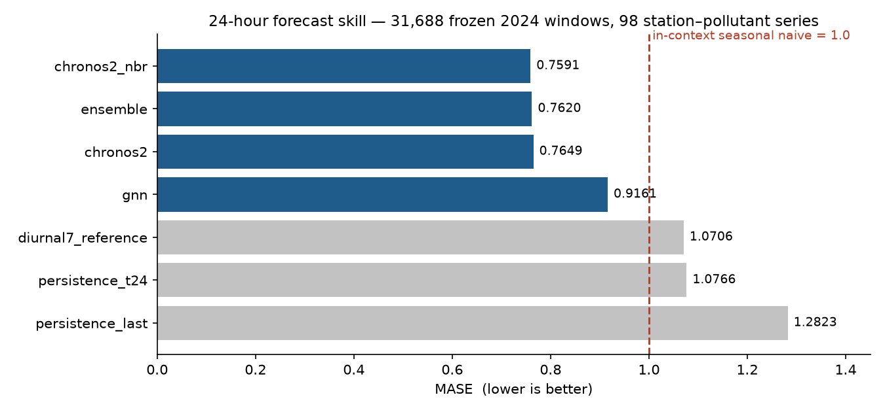
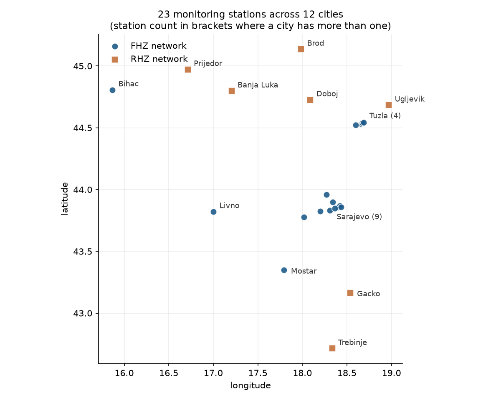
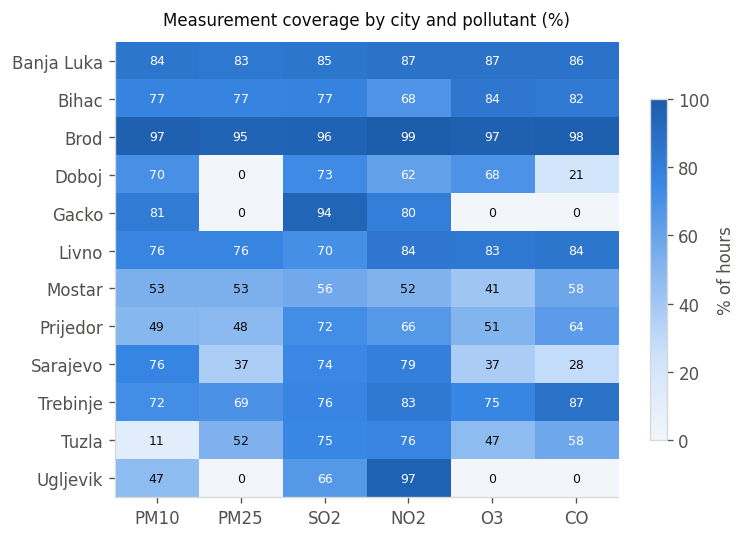
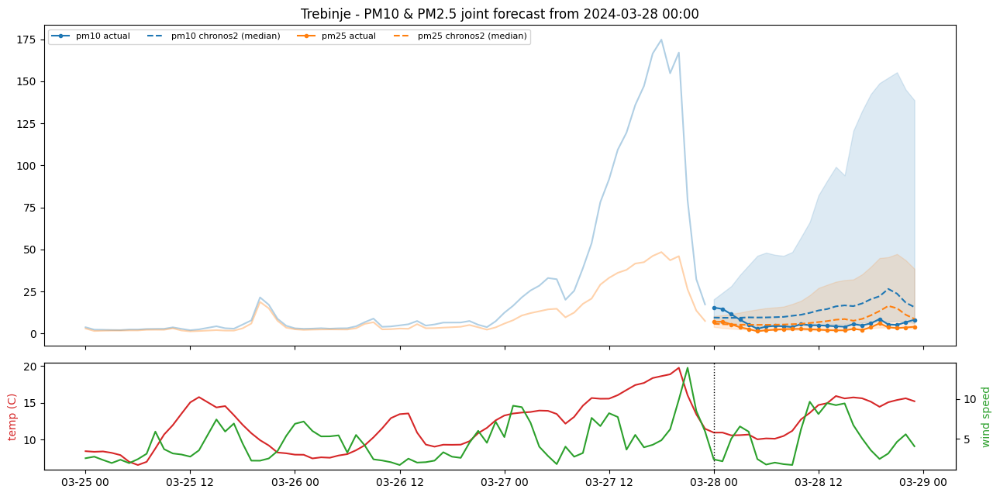
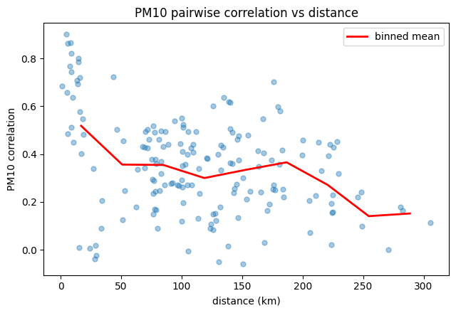

# Air Quality Forecasting for Bosnia and Herzegovina

24-hour-ahead forecasting of six air pollutants across 23 monitoring stations in Bosnia and
Herzegovina, comparing a time-series foundation model (Chronos-2), a spatial graph neural
network, an xLSTM, and classical persistence baselines on a single frozen evaluation protocol.

**Headline result: Chronos-2 forecasts 24 hours ahead at MASE 0.759–0.765, roughly 29 % better
than a seasonal-naive baseline, across all six pollutants and all four seasons.**



---

## Contents

- [Result](#result)
- [The data](#the-data)
- [Evaluation protocol](#evaluation-protocol)
- [Models](#models)
- [Findings](#findings)
- [Repository layout](#repository-layout)
- [The app](#the-app)
- [Reproducing](#reproducing)
- [Data availability](#data-availability)

---

## Result

All models are scored on the **same 31,688 held-out 2024 windows** spanning 98
station–pollutant series. MASE is the only cross-pollutant summary used, because CO is measured
in mg/m³ and everything else in µg/m³ — averaging MAE across pollutants would be meaningless.
MASE 1.0 is the in-context seasonal-naive forecast.

| Model | MASE | MAE | WQL | vs. `persistence_t24` |
|---|---:|---:|---:|---:|
| `chronos2_nbr` — Chronos-2 + neighbour covariates | **0.7591** | 7.090 | 0.1445 | **+29.5 %** |
| `ensemble` — Chronos-2 + GNN blend | 0.7625 | **7.090** | 0.1446 | +29.2 % |
| `chronos2` — Chronos-2, weather covariates | 0.7649 | 7.138 | 0.1449 | +28.9 % |
| `gnn` — ConvLSTM → GAT spatial model | 0.9352 | 11.865 | — | +13.1 % |
| `diurnal7_reference` — 7-day diurnal climatology | 1.0706 | 10.656 | — | +0.6 % |
| `persistence_t24` — value 24 h ago (baseline) | 1.0766 | 10.440 | — | 0 |
| `persistence_last` — last observed value | 1.2823 | 12.244 | — | −19.1 % |

**How to read the top three rows.** They are separated by 0.4–0.8 %, which is within the noise
of a single held-out year. The neighbour-covariate variant `chronos2_nbr` wins on 2024 but was
*worse* than plain `chronos2` on the 2023 tuning year (0.7297 vs. 0.7294) — a sign flip on a
0.03 % gap, which is what noise looks like. The `ensemble` is the only one of the three whose
advantage was earned honestly out-of-sample: its blend weights were fitted on 2023 and *then*
beat their own base on 2024. Treat "Chronos-2" as the result and the 0.759/0.762/0.765 spread
as a tie.

Chronos-2 wins on **every** cut of the data — all six pollutants, both heating and non-heating
regimes, all four seasons — which is stronger evidence than the headline number alone.

### Where the GNN earns its place

The GNN loses clearly on point accuracy (MASE 0.935 vs. 0.765) but has by far the best
**weighted quantile loss** — 0.0649 against 0.1445 on an earlier run, i.e. much
better-calibrated uncertainty, though that figure has not been recomputed for the current
run. Its MASE also moves by about 0.02 between training runs, so treat it as approximate. It also
only covers PM10 and PM2.5, so in the blend it can only affect those two pollutants — the
ensemble's CO / NO₂ / O₃ / SO₂ numbers are identical to plain Chronos-2 by construction.

---

## The data

Two national networks, merged from raw Excel exports into a single hourly panel:

| | |
|---|---|
| **Sources** | FHZ (Federation of B&H hydrometeorological service), RHZ (Republika Srpska) |
| **Stations** | 23 stations, 12 cities |
| **Period** | 2021-01-01 → 2024-12-31 hourly (753,823 rows × 25 columns) |
| **Pollutants** | PM10, PM2.5, SO₂, NO₂, O₃, CO |
| **Covariates** | temperature, wind speed |



Coverage is uneven, and this drives most of the design decisions downstream — Tuzla records
PM10 for only 11 % of hours, Gacko and Ugljevik never record PM2.5, O₃ or CO at all:



Gaps of up to 3 hours were linearly interpolated during the dataset build, and every
interpolated point is flagged in a `<pollutant>_filled` column. **Filled values are allowed as
model input but never scored** — otherwise the metrics would be measuring our own interpolation
rather than the model.

---

## Evaluation protocol

The protocol is frozen in `dataset/shared/` before any model was trained, and all three model
tracks import the same module (`bih_shared.py`) so the numbers are comparable by construction.

- **Split** — train 2021-01-01 → 2023-12-31; evaluate on 2024. 2025 is excluded entirely
  (FHZ has no 2025 data, and an RHZ-only year is not comparable).
- **Task** — 24-hour horizon, forecast origins at 00:00, 24-hour stride.
- **Masking** — score a point only where the value is present *and* not interpolated. A window
  needs ≥ 12 real target hours to be included.
- **Metrics** — MAE and RMSE per pollutant in native units; MASE (denominator = in-context
  seasonal-naive MAE at lag 24) as the only cross-pollutant summary.
- **Windows** — 31,688 frozen windows across 98 station–pollutant series, listed explicitly in
  `dataset/shared/eval_windows.csv`.

Baselines, for reference (`dataset/shared/baseline_metrics.csv`):

| Pollutant | `persistence_last` MASE | `persistence_t24` MASE |
|---|---:|---:|
| CO | 1.394 | 1.053 |
| NO₂ | 1.512 | 1.040 |
| O₃ | 1.403 | 1.050 |
| PM10 | 1.162 | 1.077 |
| PM2.5 | 1.203 | 1.052 |
| SO₂ | 1.043 | 1.159 |

---

## Models

### Chronos / Chronos-2 — `notebooks/04_chronos/`

Zero-shot forecasting with Amazon's Chronos time-series foundation models, run in three stages:
univariate zero-shot → all six pollutants → **Chronos-2 multivariate with weather covariates**,
which is the version that produced the headline result. No training on the target series.



### Spatial GNN — `notebooks/05_gnn/`

ConvLSTM → Dense/ReLU → GAT → Dense/ReLU over a station graph with two edge types: `close_to`
(distance-thresholded, not k-NN) and `same_type` (shared station classification — urban,
industrial, urban-background…). The distance threshold came directly from the EDA below.
Trained per station-group partition, PM10 and PM2.5 only.

### xLSTM — `notebooks/06_xlstm/`

Six iterations, and an honest negative result. PM2.5 trained cleanly and beat every baseline
(MASE 0.845 vs. 1.049 for `persistence_t24`); every other pollutant diverged, with mean MASE
running into the thousands while medians stayed respectable (0.81–0.91 overall). That gap
between mean and median is the whole story: a minority of windows blow up completely. The
track is included in full — diagnostics and all — but is not in the results table, because a
model that is unstable on five of six pollutants is not a model you report.

### Ensemble — `notebooks/07_ensemble/`

Blends Chronos-2 with the GNN, with blend weights fitted per pollutant and heating regime on
2023 and evaluated on 2024. Also contains the spatial diagnostic that justified the GNN track
in the first place.

---

## Findings

**1. A foundation model beats the classical baselines by a wide margin, zero-shot.**
Chronos-2 reaches MASE 0.765 with no training on these series at all, against 1.077 for
seasonal persistence. The gain is consistent across every pollutant, season and regime.

**2. Spatial signal exists, but it is small.** Neighbour-station covariates improve Chronos by
2.1 % on the Sarajevo diagnostic set — real, but marginal:



Cross-station PM10 correlation decays sharply past ~30–50 km, which is why the GNN uses a
distance cutoff rather than k-nearest-neighbours (a fixed `k=5` was connecting Trebinje to
Banja Luka, 280 km apart, just to fill slots).

**3. The blend does not add much, and we say so.** +0.38 % over its own base. The notebook's
own verdict flags this as within noise and recommends reporting Chronos alone.

**4. Autumn is the hard season.** Every model degrades in autumn (Chronos-2 0.890, GNN 1.096)
and does best in spring (0.643 / 0.850). The heating season is harder than the non-heating
season for every model except the GNN, which reverses it.

**5. Uncertainty and point accuracy come apart.** The GNN is the worst of the learned models on
MASE and, on an earlier run, the best on WQL by a factor of two — worth knowing if the
downstream use is threshold exceedance probability rather than a point forecast.

---

## Repository layout

```
├── notebooks/
│   ├── 01_ingest/       Raw Excel → per-source CSV (FHZ pollutants, temperature,
│   │                    wind; RHZ pollutants)
│   ├── 02_dataset/      build_dataset.ipynb  → the merged hourly panel
│   │                    shared_setup.ipynb   → freezes split, windows, baselines
│   ├── 03_eda/          eda.ipynb            → coverage, PM2.5-from-PM10 ratio
│   │                    spatial_eda.ipynb    → correlation vs. distance, graph design
│   ├── 04_chronos/      01 zero-shot → 02 all pollutants → 03 Chronos-2 + weather
│   ├── 05_gnn/          ConvLSTM → GAT spatial model
│   ├── 06_xlstm/        Six iterations + diagnostics (negative result)
│   └── 07_ensemble/     01 prototype → 02 full  ← final results table lives here
├── dataset/
│   └── shared/          Frozen experiment definition (tracked in git)
├── app/                 Streamlit app (app.py + pages/, data in app/data/)
├── scripts/             prepare_app_data.py — builds the app's data files
├── images/              README figures
└── docs/REPORT.md       Full technical report
```

`dataset/shared/` is the contract between the three model tracks:

| File | What it fixes |
|---|---|
| `bih_shared.py` | Loading, masking, and metric definitions — imported by every track |
| `split.json` | Train/val boundary, horizon, masking rule, metric policy |
| `eval_windows.csv` | The 31,688 frozen forecast origins |
| `baseline_metrics.csv` | Persistence baselines, per pollutant |
| `station_coords.csv` | Station locations and classifications |
| `station_distance_km.csv` | Pairwise great-circle distances (GNN edges) |
| `station_groups.json` | Per-station pollutant capability: `never` / `sparse` / `ok` |
| `pm25_pm10_ratio.json` | Fitted PM2.5-from-PM10 ratio |

---

## The app

An interactive Streamlit app for exploring the forecasts and the monitoring network.

```bash
pip install -r requirements.txt
python scripts/prepare_app_data.py
streamlit run app/Forecasts.py
```

Two pages. **Forecast viewer** — pick a station, pollutant and day, and see what each
model predicted for the next 24 hours against what was actually measured, with the
10th–90th percentile band, per-hour error, and how that series scores across the whole
year. **Stations** — the 23 stations on a map, coloured by coverage or by forecast skill,
with a detail view per station.

`scripts/prepare_app_data.py` builds the small parquet files the app reads. It slims the
160 MB panel to the evaluation period and casts to float32, giving about 4.5 MB — small
enough to commit and deploy.

The forecasts themselves come from the final cell of
`notebooks/07_ensemble/02_ensemble_full.ipynb`, which exports every model's predictions
to `forecasts.parquet`. Put that file in `results/` and re-run the prepare script. Without
it the app still runs — the station map works, and the forecast viewer explains what is
missing.

Dependencies are split deliberately: `requirements.txt` holds only what the app imports,
so Streamlit Community Cloud can build it; the modelling stack is in
`requirements-notebooks.txt`.

## Reproducing

```bash
git clone <this-repo>
cd air_pollution_bih
python -m venv .venv && source .venv/bin/activate
pip install -r requirements-notebooks.txt
```

`torch-geometric` needs a build matching your torch/CUDA combination — install it per the
[official instructions](https://pytorch-geometric.readthedocs.io/en/latest/install/installation.html)
rather than from `requirements-notebooks.txt` alone.

Then run the notebooks in numeric order. `01_ingest` and `02_dataset` need the raw sources
(see below); everything from `04_chronos` onward needs only `dataset/shared/` plus the built
hourly panel. The notebooks were developed in Google Colab with GPU, and the model tracks pull
the frozen shared artifacts via `gdown` rather than assuming a local checkout.

## Data availability

The raw Excel sources and the built hourly panel (~780 MB) are **not** in this repository. The
raw measurements are published by the two national hydrometeorological services (FHZ and RHZ);
`notebooks/01_ingest` and `notebooks/02_dataset/build_dataset.ipynb` rebuild the panel from
them end to end.

What *is* tracked is `dataset/shared/` — the frozen split, evaluation windows, station geometry
and baseline metrics — which is everything needed to check that a new model was evaluated on
exactly the same footing as the ones reported here.
